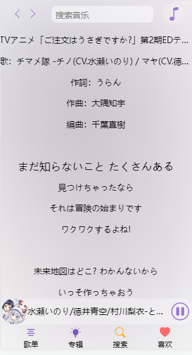

# 琥珀云音乐

### 介绍
琥珀云音乐移动端,修改自迷你音乐安卓端(https://gitee.com/cgper/mini-music-mobile/)

配合后端工程(https://github.com/huhaku/huhaku-cloud-music-api)

### 截图

### 开发

#### 安装依赖
> npm install
#### 调试
> npm run serve
#### 打包dist
> npm run build
#### 打包安卓安装包
此app用到DCloud的5+App技术，所以必须使用HBuilderX App开发版进行打包。

